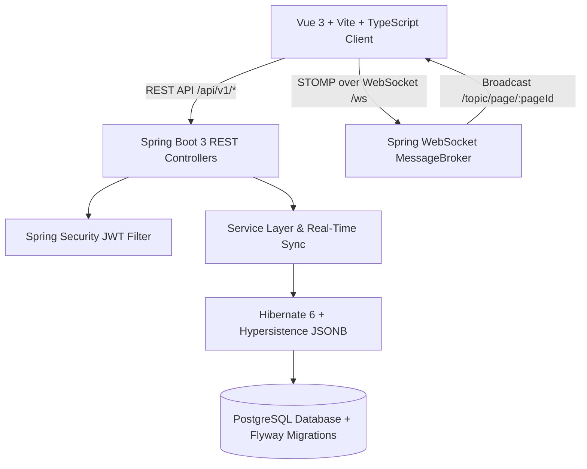

# Implementation Plan - Real-Time Workspace Platform (Notion/Trello Hybrid)

Build a full-stack real-time collaboration workspace platform featuring Notion-style block-based documents, Trello-style interactive Kanban boards, and multi-user live cursor and content sync using Spring Boot 3 (STOMP WebSockets, Spring Security JWT, Flyway, PostgreSQL JSONB) and Vue 3 (Composition API, TypeScript, Pinia, Tailwind CSS, VueDraggable).

## Proposed Architecture & Structure



### Directory Structure
```
Real-Time Workspace project/
├── docker-compose.yml              # PostgreSQL setup
├── backend/
│   ├── pom.xml                     # Spring Boot 3 Maven config
│   ├── mvnw & mvnw.cmd             # Maven Wrapper scripts
│   ├── .mvn/wrapper/               # Maven wrapper config
│   └── src/
│       └── main/
│           ├── java/com/workspace/
│           │   ├── WorkspaceApplication.java
│           │   ├── config/         # SecurityConfig, WebSocketConfig, WebMvcConfig, JacksonConfig
│           │   ├── controller/     # AuthController, WorkspaceController, PageController, BlockController, RealtimeController
│           │   ├── dto/            # Request/Response DTOs & Realtime payload definitions
│           │   ├── entity/         # User, Workspace, WorkspaceMember, Page, Block (JSONB content)
│           │   ├── repository/     # Spring Data JPA repositories
│           │   ├── security/       # JwtService, JwtFilter, UserDetailsServiceImpl, SecurityUtils
│           │   └── service/        # AuthService, WorkspaceService, PageService, BlockService
│           └── resources/
│               ├── application.yml
│               └── db/migration/   # V1__initial_schema.sql, V2__seed_demo_data.sql
└── frontend/
    ├── package.json
    ├── vite.config.ts
    ├── tsconfig.json
    ├── tailwind.config.js
    ├── postcss.config.js
    ├── index.html
    └── src/
        ├── App.vue
        ├── main.ts
        ├── assets/main.css
        ├── router/index.ts
        ├── types/workspace.ts
        ├── stores/auth.ts
        ├── stores/workspace.ts
        ├── services/api.ts
        ├── services/websocket.ts
        └── components/
            ├── layout/WorkspaceLayout.vue
            ├── editor/BlockEditor.vue
            ├── editor/SlashMenu.vue
            ├── kanban/KanbanBoard.vue
            ├── realtime/LiveCursors.vue
            └── auth/AuthModal.vue
```

## User Review Required

> [!NOTE]
> - Backend uses PostgreSQL with JSONB columns for flexible block content schema (`{"text": "...", "checked": false, "level": 1, "color": "blue"}`).
> - STOMP WebSockets broadcast both Block CRUD operations and Live Cursor movements (`{ userId, name, avatar, x, y, activeBlockId }`).
> - The frontend provides instant optimistic UI updates for both document typing and Kanban drag-and-drop.

## Proposed Changes

### 1. Database Schema & Flyway Migrations
- `backend/src/main/resources/db/migration/V1__initial_schema.sql`: Full DDL with UUID primary keys, foreign keys, JSONB columns, and performance indexes.
- `backend/src/main/resources/db/migration/V2__seed_demo_data.sql`: Seed data with demo users, workspace, documents, and Kanban board blocks.

### 2. Spring Boot 3 Backend
- **Maven Configuration (`pom.xml`)**: Java 17+, Spring Boot 3.3.x, Spring Data JPA, Spring Security, Spring WebSocket, Flyway, PostgreSQL, `jjwt-api 0.12.5`, `hypersistence-utils-hibernate-63`.
- **Entities**:
  - `User`: UUID, email, password, name, avatarUrl, timestamps.
  - `Workspace`: UUID, name, slug, owner, timestamps.
  - `Page`: UUID, workspace, parentPageId, title, icon, isKanban, position.
  - `Block`: UUID, page, parentId, type (paragraph, heading, todo, kanban_column, kanban_card, callout, code), content `Map<String, Object>` mapped with `@Type(JsonType.class)`, position.
- **Security & JWT**: Stateless filter chain, JWT token generator/validator, password encryption with BCrypt, STOMP connection authentication.
- **REST APIs**:
  - `/api/v1/auth/*`: register, login, current user.
  - `/api/v1/workspaces/*`: CRUD, member listings.
  - `/api/v1/pages/*`: CRUD, reordering, duplicate, kanban toggle.
  - `/api/v1/pages/{pageId}/blocks/*`: CRUD, batch reorder positions, bulk update.
- **WebSocket STOMP Channel**:
  - Endpoint `/ws` with SockJS fallback.
  - Message broker `/topic` and application prefix `/app`.
  - `@MessageMapping("/page/{pageId}/update")` broadcasting to `/topic/page/{pageId}`.

### 3. Vue 3 + TypeScript Frontend
- **Dependencies**: `vue`, `vue-router`, `pinia`, `@stomp/stompjs`, `sockjs-client`, `vuedraggable@next`, `lucide-vue-next`, `axios`, `tailwindcss`.
- **State Management**:
  - `auth.ts`: Authentication state, user profile, token persistence.
  - `workspace.ts`: Workspaces, pages, active page, block tree/list, live cursors map, optimistic drag-and-drop & block mutation handling.
- **WebSocket Service (`websocket.ts`)**: Reconnection logic, STOMP subscription management, throttled cursor position broadcasting.
- **Key Components**:
  - `WorkspaceLayout.vue`: Dark/light mode, sidebar navigation, collapsible page hierarchy, live online peer avatars.
  - `BlockEditor.vue`: Notion-style block editor with keyboard shortcuts (Enter for new block, Backspace to delete/merge, `/` for slash menu), inline formatting, drag reordering.
  - `KanbanBoard.vue`: Trello-style multi-column board using `vuedraggable` with cross-column card drag-and-drop, inline card addition, column renaming, and real-time block coordinate synchronization.
  - `LiveCursors.vue`: Multiplayer live cursor overlay rendering peer cursors and avatar badges.

## Verification Plan

### Automated & Build Verification
1. Test frontend build: `npm run build` inside `frontend/` to verify TypeScript types, templates, and bundling.
2. Verify Flyway SQL scripts and Java syntax integrity.

### Manual / End-to-End Verification
1. Start PostgreSQL container via `docker-compose up -d`.
2. Launch Spring Boot application and verify Flyway migration execution and REST endpoints.
3. Launch Vue 3 dev server with `npm run dev`.
4. Test login/registration with demo accounts.
5. Test Notion block editor (create headings, todos, paragraphs, slash commands).
6. Test Trello Kanban board (create columns, add cards, drag cards across columns).
7. Test multiplayer live cursors and real-time block sync across multiple browser tabs/windows.
